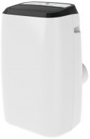

<!-- # Neuigkeiten
 -->
- 
 Im September 2020 (ca.) (Pandemie 20.3.2020) habe ich angefangen zu programmieren. 
Da gab es noch nicht ChatGpt.
- 
Meine ersten kleinen Projekte baute ich von YouTube nach. 
Dann fand ich schnell einen Kurs im Internet von Arkadius Roczniewski. Arek hatte in jungen Jahren schon ein gutes Programm geschrieben das sogar prämiert wurde.
 

nur kurz als Info: Ich habe mir für den kommenden Sommer eine Klimaanlage zugelegt.

<!--  -->

<!-- 
## Beispiel-Formatierung

- Aufzählungen
- funktionieren so
- **Fett** und *kursiv* ebenfalls -->

<!-- [app](index.html) werden zu klickbaren Links.

Du kannst diese Datei `neuigkeiten.md` jederzeit bearbeiten – der Inhalt erscheint automatisch auf der Seite. -->
