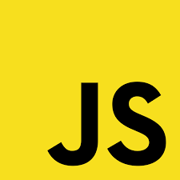
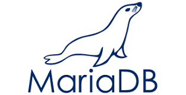

<!-- # Neuigkeiten
 -->
- 
 Im September 2020 (ca.) (Pandemie 20.3.2020) habe ich angefangen zu programmieren. 
Da gab es noch nicht ChatGpt.
- 
Meine ersten kleinen Projekte baute ich von YouTube nach. 
Dann fand ich schnell einen Kurs im Internet von Arkadius Roczniewski. Arek hatte in jungen Jahren schon ein gutes Programm geschrieben das sogar prämiert wurde.
- 

Durch Arek habe ich viel gelernt. Z.B. wie man Apps erstellt.

Javascript und Python   programmiert.  Durch Videokurse von YouTube habe ich die Datenbankanbindung an verschiedenste Datenbanktypen gelernt (MongoDB), MariaDB . 

---

Nur kurz als Info: Ich habe mir für den kommenden Sommer eine Klimaanlage zugelegt.

Sie verbraucht 1 kW pro Std. Ich benutze sie daher sehr selten.

---

<!-- 
## Beispiel-Formatierung

- Aufzählungen
- funktionieren so
- **Fett** und *kursiv* ebenfalls -->

<!-- [app](index.html) werden zu klickbaren Links.

Du kannst diese Datei `neuigkeiten.md` jederzeit bearbeiten – der Inhalt erscheint automatisch auf der Seite. -->
